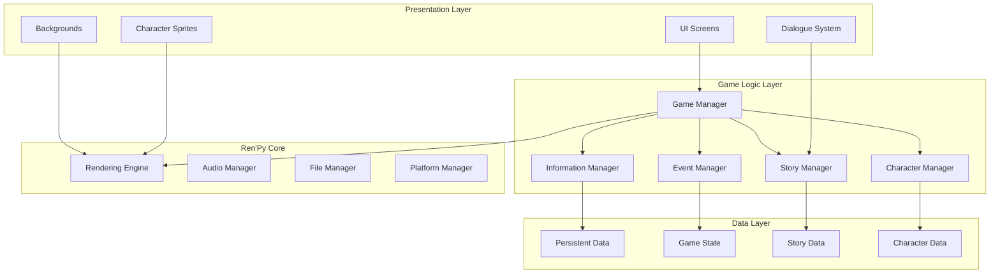

# Echo of You MVP Design Document

## Overview

This design document outlines the technical architecture and implementation approach for the Echo of You (EOY) MVP, a visual novel game built with Ren'Py. The design focuses on implementing Volume 1 (上編) with core visual novel functionality, character selection system, information gathering mechanics, and branching storylines.

The game leverages Ren'Py's built-in capabilities for dialogue management, save/load systems, and UI components while implementing custom logic for the unique information collection and confession event systems. The architecture emphasizes modularity, data-driven design, and clear separation between story content and game mechanics.

## Architecture

### System Architecture



### Directory Structure

```
EchoOfYou/
├── game/
│   ├── script.rpy                 # Main game script
│   ├── screens.rpy                # UI screen definitions
│   ├── options.rpy                # Game configuration
│   ├── gui.rpy                    # GUI customization
│   ├── characters/
│   │   ├── definitions.rpy        # Character definitions
│   │   ├── kyoko.rpy             # Kyoko route script
│   │   ├── luna.rpy              # Luna route script
│   │   └── honoka.rpy            # Honoka route script
│   ├── systems/
│   │   ├── information.rpy        # Information collection system
│   │   ├── conversation.rpy       # After-school conversation system
│   │   ├── confession.rpy         # Confession event system
│   │   └── gamestate.rpy         # Game state management
│   ├── story/
│   │   ├── prologue.rpy          # Prologue sequence
│   │   ├── epilogue.rpy          # Epilogue sequence
│   │   └── common.rpy            # Common story elements
│   ├── images/
│   │   ├── characters/           # Character sprites
│   │   ├── backgrounds/          # Background images
│   │   └── ui/                   # UI elements
│   └── audio/
│       ├── bgm/                   # Background music
│       ├── sfx/                   # Sound effects
│       └── voice/                 # Voice files (if any)
└── saves/                         # Save game files
```

## Components and Interfaces

### Core Components

#### 1. Game Manager (GM)
- **Purpose**: Central coordinator for all game systems
- **Responsibilities**:
  - Initialize game state
  - Coordinate between subsystems
  - Handle game flow transitions
  - Manage save/load operations
- **Interface**:
  ```python
  class GameManager:
      def start_new_game()
      def load_game(slot)
      def save_game(slot)
      def transition_to_scene(scene_name)
      def get_current_state()
  ```

#### 2. Character Manager (CM)
- **Purpose**: Manage character data and relationships
- **Responsibilities**:
  - Track character states
  - Manage affinity levels
  - Handle character route selection
  - Store character-specific data
- **Interface**:
  ```python
  class CharacterManager:
      def select_character(character_name)
      def get_selected_character()
      def get_character_data(character_name)
      def update_affinity(character_name, value)
      def is_route_completed(character_name)
  ```

#### 3. Information Manager (IM)
- **Purpose**: Handle information collection mechanics
- **Responsibilities**:
  - Track collected information
  - Categorize essential vs sub-information
  - Check confession unlock conditions
  - Persist information across sessions
- **Interface**:
  ```python
  class InformationManager:
      def collect_information(info_id, character_name)
      def get_collected_info(character_name)
      def has_essential_info(character_name)
      def unlock_topic(topic_id)
      def get_available_topics()
  ```

#### 4. Story Manager (SM)
- **Purpose**: Control story flow and branching
- **Responsibilities**:
  - Manage story progression
  - Handle choice branching
  - Track story flags
  - Control scene transitions
- **Interface**:
  ```python
  class StoryManager:
      def set_flag(flag_name, value)
      def check_flag(flag_name)
      def jump_to_label(label_name)
      def push_choice(choice_data)
      def get_story_progress()
  ```

#### 5. Event Manager (EM)
- **Purpose**: Handle special events and sequences
- **Responsibilities**:
  - Manage confession events
  - Control after-school conversations
  - Handle special story events
  - Track event completion
- **Interface**:
  ```python
  class EventManager:
      def trigger_event(event_name)
      def check_event_available(event_name)
      def complete_event(event_name)
      def get_event_history()
  ```

### UI Components

#### 1. Main Menu Screen
- New Game, Continue, Settings, Exit options
- Background image and title display
- Version information

#### 2. Game Screen
- Dialogue textbox with character name
- Character sprites display
- Background image layer
- Quick menu (Save, Load, Skip, Auto, Settings)

#### 3. Character Selection Screen
- Three character cards (Kyoko, Luna, Honoka)
- Character profile display
- Selection confirmation

#### 4. Information Tab Screen
- Essential information display (3 per character)
- Sub-information list
- Progress indicators
- Character categorization

#### 5. Save/Load Screen
- Multiple save slots (minimum 10)
- Thumbnail previews
- Timestamp and playtime display
- Quick save/load functionality

#### 6. Settings Screen
- Text speed adjustment
- Auto-advance speed
- Volume controls (BGM, SFX, Voice)
- Window opacity
- Display options

## Data Models

### Character Data Model
```python
character_data = {
    "kyoko": {
        "name": "Kyoko",
        "display_name": "キョウコ",
        "sprite_base": "kyoko",
        "affinity": 0,
        "essential_info": {
            "worry": None,          # ID of discovered worry/complex
            "favorite": None,       # ID of discovered favorite thing
            "memory": None          # ID of shared memory with Yu
        },
        "sub_info": [],            # List of sub-information IDs
        "route_completed": False,
        "confession_unlocked": False,
        "topics_unlocked": ["topic_school", "topic_club"]  # Starting topics
    },
    # Similar structure for luna and honoka
}
```

### Information Data Model
```python
information_db = {
    "kyoko_worry_1": {
        "character": "kyoko",
        "type": "essential",
        "category": "worry",
        "title": "Fear of Being Left Behind",
        "description": "Kyoko worries that Yu will find new friends and forget about her",
        "unlock_condition": "kyoko_conversation_3_correct"
    },
    "kyoko_sub_1": {
        "character": "kyoko",
        "type": "sub",
        "title": "Favorite Food",
        "description": "Kyoko loves strawberry cake",
        "unlock_condition": "kyoko_conversation_1_branch_a"
    }
    # Additional information entries
}
```

### Game State Model
```python
game_state = {
    "current_scene": "prologue",
    "selected_character": None,
    "completed_characters": [],
    "story_flags": {},
    "conversation_history": [],
    "choices_made": [],
    "playtime": 0,
    "chapter": "volume_1"
}
```

### Conversation Topic Model
```python
conversation_topics = {
    "topic_school": {
        "id": "topic_school",
        "name": "School Life",
        "available_for": ["kyoko", "luna", "honoka"],
        "branches": [
            {
                "text": "How's your studying going?",
                "leads_to": "study_branch",
                "possible_unlock": "kyoko_sub_2"
            }
        ]
    }
    # Additional topics
}
```

### Persistent Data Model
```python
persistent.eoy_data = {
    "unlocked_gallery": [],
    "completed_routes": [],
    "total_playtime": 0,
    "achievements": [],
    "seen_text": {},           # For skip functionality
    "unlocked_endings": [],
    "game_clear": False
}
```

## Error Handling

### Save System Error Handling
- **Corrupt Save Detection**: Validate save file integrity before loading
- **Recovery Strategy**: Maintain automatic backup saves
- **User Notification**: Display clear error messages for save/load failures
- **Fallback**: Allow continuation from last autosave point

### Asset Loading Error Handling
- **Missing Assets**: Use placeholder images/sounds when assets are missing
- **Logging**: Record all asset loading errors to debug log
- **Graceful Degradation**: Continue game with default assets if custom ones fail
- **Validation**: Pre-validate all assets on game start

### Story Flow Error Handling
- **Invalid Jump Labels**: Catch and redirect to safe story point
- **Missing Story Flags**: Initialize with default values
- **Circular Dependencies**: Detect and break infinite loops in story logic
- **State Inconsistency**: Validate game state after major transitions

### Data Corruption Prevention
- **Transaction Pattern**: Use atomic operations for state changes
- **Validation**: Check data integrity before and after modifications
- **Rollback Capability**: Maintain previous valid state for recovery
- **Regular Checkpoints**: Auto-save at stable story points

## Testing Strategy

### Unit Testing
- **Character System Tests**:
  - Character selection and route initialization
  - Affinity calculation and updates
  - Route completion tracking
  
- **Information System Tests**:
  - Information collection and categorization
  - Essential information validation
  - Confession unlock conditions
  
- **Conversation System Tests**:
  - Topic unlocking mechanics
  - Branch navigation logic
  - Information discovery triggers

### Integration Testing
- **Save/Load Testing**:
  - Save at various story points
  - Load and verify state restoration
  - Cross-session data persistence
  
- **Story Flow Testing**:
  - Complete each character route
  - Verify proper branching
  - Test all confession scenarios
  
- **UI Integration Testing**:
  - Screen transitions
  - Menu functionality
  - Settings persistence

### System Testing
- **Full Playthrough Tests**:
  - Complete game from start to epilogue
  - Test all three character routes
  - Verify information collection across routes
  
- **Performance Testing**:
  - Load times for saves and assets
  - Memory usage during extended play
  - Frame rate during sprite animations

### User Acceptance Testing
- **Story Coherence**:
  - Dialogue flow and consistency
  - Character personality consistency
  - Information revelation pacing
  
- **UI/UX Testing**:
  - Menu navigation intuitiveness
  - Text readability
  - Save/load convenience
  
- **Choice Impact Testing**:
  - Verify choices affect outcomes
  - Test information-based confession paths
  - Validate route branching logic

### Regression Testing
- **Automated Test Suite**:
  - Core functionality tests after each update
  - Save compatibility across versions
  - Asset loading verification
  
- **Manual Regression Checklist**:
  - Critical path testing
  - Edge case scenarios
  - Platform-specific features

### Platform Testing
- **Windows Testing**:
  - File system compatibility
  - Display scaling
  - Input device support
  
- **Mac Testing**:
  - macOS permissions
  - Retina display support
  - Package signing
  
- **Linux Testing**:
  - Distribution compatibility
  - Permission handling
  - Package dependencies

## Technical Decisions and Rationales

### Choice of Ren'Py
- **Rationale**: Industry-standard visual novel engine with proven stability, extensive documentation, and active community support
- **Benefits**: Built-in save/load, dialogue management, and cross-platform support reduces development time

### Data-Driven Design
- **Rationale**: Separating content from logic allows for easier story modifications and localization
- **Benefits**: Non-programmers can modify story content, easier testing of different scenarios

### Modular Architecture
- **Rationale**: Clear separation of concerns improves maintainability and allows parallel development
- **Benefits**: Different team members can work on separate systems, easier to add features later

### Persistent Data Strategy
- **Rationale**: Using Ren'Py's persistent object ensures data survives across game sessions and installations
- **Benefits**: Unlock tracking, New Game+ features, achievement system support

### Information Collection Mechanic
- **Rationale**: Core gameplay differentiator that ties into the P.mem memory-sharing theme
- **Benefits**: Adds gameplay depth beyond simple choice selection, encourages exploration of all conversation branches